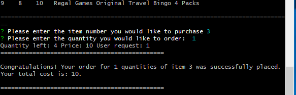

# bamazon nodeJS and mySQL app with inquirer to help interact with customer.

## Overview

In this activity, we've created an Amazon-like storefront. We're using mySQL to persist product data in the backend. This app takes in orders from customers and depletes stock from the store's inventory. 

# Pre-requisites
Before you start, you will need to do the following:
1. Download and install nodeJS from https://nodejs.org/en/download/ to run bamazon on terminal command line.
2. Download and install npm from https://www.npmjs.com/get-npm to help you get all the dependancies needed to run bamazon
3. If you would like to generate your own npm package files, on Git-bash terminal, run the following commands: 
    3.1. npm init -y
    3.2. npm install mysql
    3.3. npm install inquirer 
    However if you are using the npm package files provided here, on Git-bash terminal, run the following command:
    3.1. npm install
4. Setup MySQL server and MySQL workbench from the following link: https://dev.mysql.com/downloads/workbench/ and setup configure your connect method, hostname, user id, and password on the Database->Connect to Database tab.
5. Setup the product schema and set the products in the products table by running the following sql commands:

Create a MySQL Database called `bamazon` and a products tables:

DROP DATABASE IF EXISTS bamazon;
CREATE DATABASE bamazon;
USE bamazon;
CREATE TABLE products (
    item_id INTEGER AUTO_INCREMENT NOT NULL,
    product_name VARCHAR(30) NOT NULL,
    department_name VARCHAR(30) NOT NULL,
    price DECIMAL NOT NULL,
    stock_quantity INTEGER NOT NULL,
    PRIMARY KEY (item_id)
);

    * Populate this database with around 10 different products:

INSERT INTO products(product_name,department_name,price,stock_quantity) VALUES ('Far Cry New Dawn - Standard Edition - PS4','Video Games', 6.99,12);
INSERT INTO products(product_name,department_name,price,stock_quantity) VALUES ('Marvels Spider Man - PS4','Video Games',8.99, 4);
INSERT INTO products(product_name,department_name,price,stock_quantity) VALUES ('Red Dead Redemption 2 - PS4','Video Games',9.99, 6);
INSERT INTO products(product_name,department_name,price,stock_quantity) VALUES ('Yahtzee','Board Games',7.99,20);
INSERT INTO products(product_name,department_name,price,stock_quantity) VALUES ('Jenga Classic Game','Board Games',6.99, 6);
INSERT INTO products(product_name,department_name,price,stock_quantity) VALUES ('Sorry! Game','Board Games',6.99,23);
INSERT INTO products(product_name,department_name,price,stock_quantity) VALUES ('Travel Scavenger Hunt Card Game','Travel Games',7.43,15);
INSERT INTO products(product_name,department_name,price,stock_quantity) VALUES ('QuadPro Magnetic Travel Chess','Travel Games',14.85,8);
INSERT INTO products(product_name,department_name,price,stock_quantity) VALUES ('Regal Games Original Travel Bingo 4 Packs','Travel Games',7.99,10);
INSERT INTO products(product_name,department_name,price,stock_quantity) VALUES ('Connect 4 Grab and Go Games - Travel Size','Travel Games',4.97,15);

# Usage
1. Invoke bamazon as follows from terminal: 
##### `node bamazon.js`
   * Running this command will first display all of the items available for sale. The app then prompts users with two messages.
   * The first asks them the ID of the product they would like to buy.
   * The second message asks how many units of the product they would like to buy. 
   * Please see image below for a screenshot of this experience.
   

4. Once the customer has placed the order, bamazon application checks if the store has enough of the product to meet the customer's request.

   * If not, the app logs an appropriate error message to the customer and does not allow the order from going through. Please see image below for details of this failure path.
   

8. However, if your store _does_ have enough of the product, it fulfills the customer's order.
   * It updates the SQL database to reflect the remaining quantity.
   * Once the update goes through, it shows the customer the total cost of their purchase. 
   * Please see image below for details of this success path.

